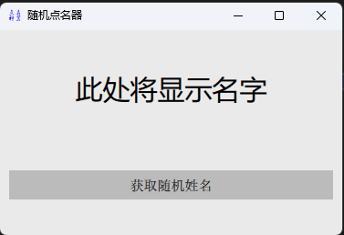
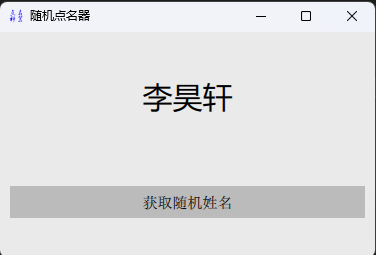

# 程序设计背景

老师上课点名考虑公平性，要求实现随机点名

# 实现功能

1. 随机点名
2. 程序每次运行每个·名字只出现一次
3. 简单混淆加密，防止同学篡改数据

# 界面预览

1. 默认
2. 点名
3. 结束

# 基本思路

1. `qml` 实现程序界面
2. `random` 实现随机点名
3. `base64` 实现名单混淆

# 具体实现

## 辅助程序：对名单进行 `base64` 混淆

```python-repl
from pathlib import Path
import yaml

import base64


inputPath = Path(__file__).parent.parent / "data" / "yaml"
outputPath = Path(__file__).parent.parent / "data" / "base64"

for file in inputPath.iterdir():
    yml: list = yaml.load(file.read_text(encoding="utf-8"), Loader=yaml.FullLoader)
    code = base64.encodebytes(str(yml).encode("utf-8"))
    output = outputPath / file.name.replace(".yml", "")
    output.write_text(code.decode("utf-8"), encoding="utf-8")
```

1. 通过 `pathlib` 确定输入输出路径
2. 把从名单(YAML)中读取的数据混淆后保存

## 主程序

### 读取名单

```python
names: list[str] = eval(
    base64.decodebytes(
        (DATA / "names").read_text(encoding="utf-8").encode("utf-8")
    ).decode("utf-8")
)
```

将数据目录下的 `names` 文件进行读取，解码

### 运行过程中的处理

```python
class UI(QObject):
    def __init__(self):
        super().__init__()

    @Slot(result=str)
    def run(self):
        name = random.choice(names) if names else "没有名字了，重启程序以继续"
        try:
            names.remove(name)
        except:
            ...
        return name
```

在ui调用 `run()` 方法时返回随机姓名，并将其从名单中删除

### 启动程序

```python
if __name__ == "__main__":
    app = QGuiApplication([])
    app.setWindowIcon(QIcon(str(ROOT / "icon.png")))

    qmlRegisterType(UI, "Py", 1, 0, "Py")

    engine = QQmlApplicationEngine()
    engine.addImportPath(QML)
    engine.addImportPath(QML / "imports")

    engine.load(QML / "main.qml")

    if not engine.rootObjects():
        sys.exit(-1)

    sys.exit(app.exec())

```

1. 设置图标
2. 设置qml工程文件夹、`imports` 文件夹为导入路径，避免qml加载失败
3. 运行

## UI实现

### Qt Design Studio 使用

安装 `Qt Design Studio` ，用其创建工程（前人之述备矣，本文不再赘述，具体情况参考下面两位大佬的文章）

1. [Qt Design Studio](https://blog.csdn.net/qq_38880380/article/details/126672096?ops_request_misc=%257B%2522request%255Fid%2522%253A%2522171016805116800213083849%2522%252C%2522scm%2522%253A%252220140713.130102334.pc%255Fall.%2522%257D&request_id=171016805116800213083849&biz_id=0&utm_medium=distribute.pc_search_result.none-task-blog-2~all~first_rank_ecpm_v1~rank_v31_ecpm-5-126672096-null-null.142^v99^pc_search_result_base4&utm_term=qt%20design%20studio%E6%80%8E%E4%B9%88%E7%94%A8&spm=1018.2226.3001.4187)
2. [QML 项目中使用 Qt Design Studio 生成的UI界面](https://blog.csdn.net/qq_34139994/article/details/135363950?ops_request_misc=&request_id=&biz_id=102&utm_term=qt%20design%20studio%E6%80%8E%E4%B9%88%E7%94%A8&utm_medium=distribute.pc_search_result.none-task-blog-2~all~sobaiduweb~default-4-135363950.142^v99^pc_search_result_base4&spm=1018.2226.3001.4187)

### qml核心代码详解

```qml
import QtQuick 6.5
import QtQuick.Controls 6.5
import Ui
import QtQuick.Layouts
import Py

Rectangle {
    id: page
    width: Constants.width
    height: Constants.height
    anchors.fill: parent
    color: Constants.backgroundColor

    Py {
        id: py
    }

    ColumnLayout {
        anchors.left: parent.left
        anchors.right: parent.right
        anchors.top: parent.top
        anchors.bottom: parent.bottom
        anchors.rightMargin: 10
        anchors.leftMargin: 10
        anchors.bottomMargin: 10
        anchors.topMargin: 10

        Text {
            id: name
            text: qsTr("此处将显示名字")
            font.pixelSize: 30
            horizontalAlignment: Text.AlignHCenter
            Layout.fillWidth: true
            Layout.preferredWidth: 216
            Layout.preferredHeight: 39
        }

        Button {
            id: run
            text: qsTr("获取随机姓名")
            Layout.leftMargin: 0
            Layout.fillWidth: true

            Connections {
                target: run
                onClicked: name.text = py.run()
            }
        }
    }
}

```

1. 导入
   1. QtQuick组件
   2. 工程组件（Ui，有工程名称决定）
   3. python交互
      1. 在本文中为 `Py.Py`
      2. 由代码 `qmlRegisterType(UI, "Py", 1, 0, "Py")` 定义
         1. `UI` 为python中的类名
         2. 两个 `"Py" 分别为qml中的包名和模块名`
         3. 数字为其版本号
2. 连接python
   1. 将对象 `id` 设为py
   2. 在后续程序中直接调用python函数
3. 文本框
4. 按钮
   1. 在点击时调用 `name.text = py.run()` 更新文本框
   2. 填充窗口的宽

# 特别说明

本程序已开源：[Gitee](https://gitee.com/dudu7615/python/tree/master/%E7%82%B9%E5%90%8D)
