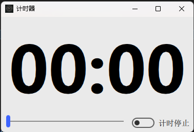
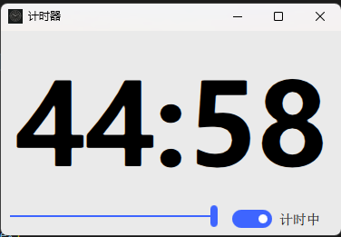
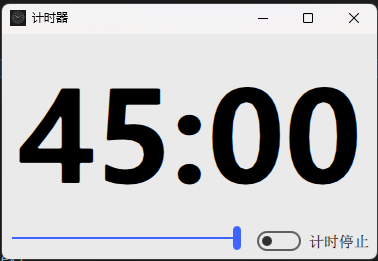

# 实现功能

1. 通过qt的qml系列实现
2. 自定义计时时间
3. 滑动条控制时间长短
4. 支持暂停继续

# 程序预览

## 默认



## 计时



## 暂停



# 基本思路

1. 使用 `qml` 绘制窗口
2. 通过 `qrc` 打包资源文件
3. 通过 `QQmlApplicationEngine().addImportPath()` 添加导入路径
4. 通过 `QThread` 进行计时
5. 通过 `QMutex` 与 `QWaitCondition` 实现暂停功能
6. 通过 `win32com` 实现计时语言播报

# 具体实现

## `qml` 绘制窗口

1. 使用 `qt` 的 `Qt Design Studio` 创建项目
2. 绑定python类(后面会详细讲)

   1. 在qml中输入 `import py`
   2. 在 `root` 中定义 `Py {id: py}`
3. 编写ui和事件控制(4个信号监视器)

   ```qml
    Connections {
        target: start
        onCheckedChanged: {
            if (chooseTime.value != 0) {
                py.start(start.checked)

                if (start.checked) {
                    start.text = qsTr("计时中")
                } else {
                    start.text = qsTr("计时停止")
                }
            } else {
                start.checked = false
            }
        }
    }

    Connections {
        target: chooseTime
        onValueChanged: {
            py.changeTime(chooseTime.value)
            start.checked = false
        }
    }

    Connections {
        target: py
        function onSignal(time) {
            showTime.text = time
        }
    }

    Connections {
        target: root

        onWidthChanged: {
            showTime.font.pixelSize = root.width / 3
            win.minimumHeight = showTime.font.pixelSize
        }

        onHeightChanged: {
            showTime.font.pixelSize = root.width / 3
            win.minimumHeight = showTime.font.pixelSize
        }
    }
   ```

   1. 原理介绍(Connections)
      1. 作用：用来监视信号
      2. 参数
         1. target：后接被监视对象的id
         2. onSignal
            1. 表示接受的信号
            2. 格式为 `on<信号名(首字母大写)>: {<doSomething>}`
            3. 信号名可以是自带的，也可以是自定义的信号
            4. 如果需要从信号中接收参数，则建议写为 `function onSignal(argv) {<doSomethong>}` 其中function为定义函数，argv表示接收的参数
   2. 具体实现
      1. 开始按钮的点击(target: star)
         1. 调用python函数，开始计时或暂停
         2. 设置自身文字标注
         3. 禁止在时间为0时开始计时
      2. 选择时间的滑动条(target: chooseTime)
         1. 调用python函数，传递当前时间数字
         2. 将计时开关关闭
      3. python传递的当前时间(target: py)
         1. 设置文本框显示的时间
      4. 监视窗口大小改变(target: root)
         1. 设置时间文字大小为窗口宽度的 $\frac{1}{3}$
         2. 设置窗口最小高度为文字高度

## `qrc` 打包资源文件

1. 在 `content` 目录下新建文件 `qmldir` 并写入以下内容
   1. ```qmldir
      module content
      App 1.0 App.qml
      Screen01.ui 1.0 Screen01.ui.qml
      ```
   2. 语法说明
      1. `model <模块名>`
      2. `<类名> <版本号> <文件路径>`
2. 在 `Qt Design Studio` 中点击 `文件-export project-…QRC…`
3. 不要改变默认路径，选择所有文件
4. 通过 `pyside6-rcc.exe <qrc路径> -o <py路径>`
5. 前人之述备矣，详见 <[Qt Design Studio导出项目到python中使用][Qt Design Studio导出项目到python中使用]>(注：只看打包部分即可，无法导入后续问题我会讲解)

## 添加导入路径&加载qmlwj

```python
engine = QQmlApplicationEngine()
engine.addImportPath("qrc:/")
engine.addImportPath("qrc:/imports")
engine.load(":/main.qml")
```

1. QQmlApplicationEngine() 为qml加载器，可以显示qml窗口
2. addImportPath() 用来添加qml的import搜索路径(冒号签到qrc可以省略)
3. load() 用来加载并显示qml

## `QThread` 线程计时

```python
class Main(QThread):
    signal = Signal(int)
    paused = False

    def __init__(self):
        super().__init__()
        self.secs = 0
        self.mutex = QMutex()
        self.pauseCond = QWaitCondition()

    def run(self):
        for i in range(self.secs, -1, -1):
            self.mutex.lock()

            if self.paused:
                self.pauseCond.wait(self.mutex)
            self.mutex.unlock()

            self.signal.emit(i)
            time.sleep(1)

    def pause(self):
        self.mutex.lock()
        self.paused = True
        self.mutex.unlock()

    def resume(self):
        self.mutex.lock()
        self.paused = False
        self.pauseCond.wakeAll()
        self.mutex.unlock()

```

1. 信号 `signal` 用于通知用户界面当前秒数
2. `paused` 用于标识当前程序是否暂停
3. `QMutex` 与 `QWaitCondition` 用来实现线程锁与等待
   1. `QMutex.lock()` 后，如果再次调用 `QMutex.lock()` 会被阻塞，直到 `QMutex.unlock()` 后继续执行
   2. `QWaitCondition.wait()` 方法来等待条件变为真，如果条件不满足，程序将会被阻塞，并且会自动释放互斥锁. `QWaitCondition.wakeAll()` 被调用后会唤醒被暂停的操作

## 语言朗读

```python
from win32com import client
def speak(self, text: str):
    engine = client.Dispatch("SAPI.SpVoice")
    engine.Speak(text)
```

通过调用 `win32com` 实现

## 计时线程回调处理

```python
def callBack(self, msg: int):
    min, sec = divmod(msg, 60)
    self.signal.emit(f"{min:02d}:{sec:02d}")

    if msg == 0 and self.min != 0:
        self.signal.emit(f"{min:02d}:{sec:02d}")
        Thread(target=self.speak, args=(f"{self.min}分钟计时完成",)).start()
```

1. 将回调得到的秒数转换为分钟和秒
2. 格式化后emit() 给qml
3. 如果计时完成，进行语言播报

# 特别说明

1. 本程序在gitee上已开源 [开源地址][Gitee]
2. 本程序有一个旧版本，为qwidget实现，详见 [QWidget版][QWidget]

[Qt Design Studio导出项目到python中使用]: https://blog.csdn.net/wenxingchen/article/details/128507953
[Gitee]: https://gitee.com/dudu7615/python/tree/master/计时器/qml
[QWidget]: https://zhuanlan.zhihu.com/p/662635654
