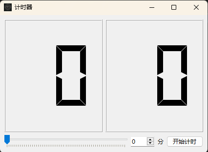
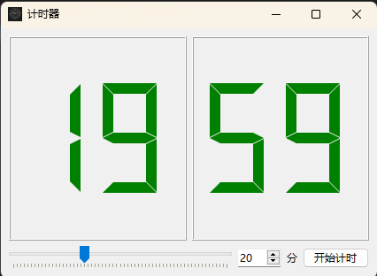
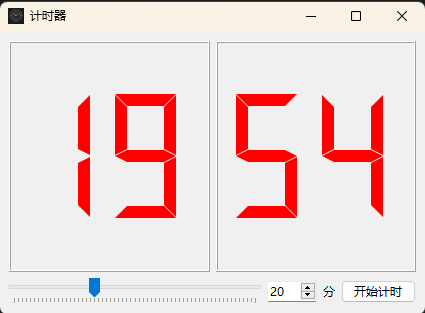

# 实现功能

1. 通过qt的widget系列实现
2. 自定义计时时间
3. 滑动条控制时间长短
4. 支持暂停继续

# 程序预览

## 默认



## 计时



## 暂停



# 基本思路

1. 重写 `QLCDNumber` 实现鼠标点击暂停/开始，自动切换颜色
2. 通过 `QThread` 进行计时
3. 通过 `QMutex` 与 `QWaitCondition` 实现暂停功能
4. 通过 `win32com` 实现计时语言播报
5. 通过 `QMessageBox.information` 实现弹窗提醒

# 具体实现

## 重写 `QLCDNumber`

```python
class Number(QLCDNumber):
    clicked = Signal()
    def mousePressEvent(self, event: QMouseEvent) -> None:
        self.clicked.emit()
```

    创建`clicked` 信号，在鼠标点击时调用

## `QThread` 线程计时

```python
class Main(QThread):
    signal = Signal(int)
    paused = False

    def __init__(self):
        super().__init__()
        self.mutex = QMutex()
        self.pauseCond = QWaitCondition()

    def run(self):
        for i in range(secs):
            time.sleep(1)
            self.mutex.lock()

            if self.paused:
                self.pauseCond.wait(self.mutex)
            self.mutex.unlock()

            self.signal.emit(i)

    def pause(self):
        self.mutex.lock()
        self.paused = True
        self.mutex.unlock()

    def resume(self):
        self.mutex.lock()
        self.paused = False
        self.pauseCond.wakeAll()
        self.mutex.unlock()

```

1. 信号 `signal` 用于通知用户界面当前秒数
2. `paused` 用于标识当前程序是否暂停
3. `QMutex` 与 `QWaitCondition` 用来实现线程锁与等待
   1. `QMutex.lock()` 后，如果再次调用 `QMutex.lock()` 会被阻塞，直到 `QMutex.unlock()` 后继续执行
   2. `QWaitCondition.wait()` 方法来等待条件变为真，如果条件不满足，程序将会被阻塞，并且会自动释放互斥锁. `QWaitCondition.wakeAll()` 被调用后会唤醒被暂停的操作

## 语言朗读

```python
from win32com import client
def speak(self, text: str):
    engine = client.Dispatch("SAPI.SpVoice")
    engine.Speak(text)
```

通过调用 `win32com` 实现

## 计时器文字颜色切换

```python
def timeClicked(self):
    if not self.main.paused:
        self.ui.min.setStyleSheet("color: red;")
        self.ui.sec.setStyleSheet("color: red;")
        # self.falg = False
        self.main.pause()

    else:
        self.ui.min.setStyleSheet("color: green;")
        self.ui.sec.setStyleSheet("color: green;")
        # self.falg = True
        self.main.resume()

```

1. 在窗口文字被点击时调用
2. 如果原本计时没有暂停，暂停计时并将窗口文字设为红色
3. 如果原本计时已经暂停，继续计时并将窗口文字设为绿色

## 计时线程回调处理

```python
def callBack(self, msg: int):
    if self.ui.sec.value() == 0:
        self.ui.min.display(self.ui.min.value() - 1)
        self.ui.sec.display(59)
    else:
        self.ui.sec.display(self.ui.sec.value() - 1)
    # self.ui.showTime.display(secs - (msg + 1))
    if secs == msg + 1:
        Thread(target=self.speak, args=(f"{secs}秒计时完成",)).start()

        reply = QMessageBox.information(
            self, "时间到", f"{secs}秒 计时完成\n按<OK>键关闭程序",
            QMessageBox.StandardButton.Ok | QMessageBox.StandardButton.Close)

        if reply.name == "Close":
            sys.exit()
```

1. 简单处理，在窗口上显示时间(继续优化：通过回调值重设时间)
2. 如果计时结束，语言提醒并弹窗(继续优化：将时间改为以分钟为单位)

# 完整代码

Gitee: [Gitee.com](https://gitee.com/dudu7615/python/tree/master/计时器/widgwt)
